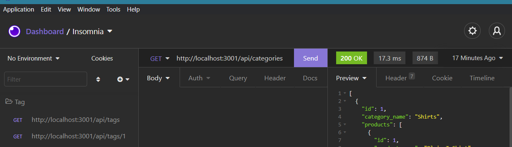

# employeeTracker

## Summary  

This project will build the back end for an e-commerce site. It uses Express.js to configure routes and Sequelize to interact with a MySQL database. the project uses .env to save envirnoment vairables to seperate file. it will also use insonima to test backend routes.

## Installation

install Node. After install node type the following
npm init
npm install
npm start

## Walkthrough Video

https://drive.google.com/file/d/1-42UcB7wkR_GQt1rPjbljFzEnmN6qX2b/view?usp=sharing

## Tools used

Node,Express,dotenv,squelelize,insonima and msql2.

## Contributors

Zohaib Ali
